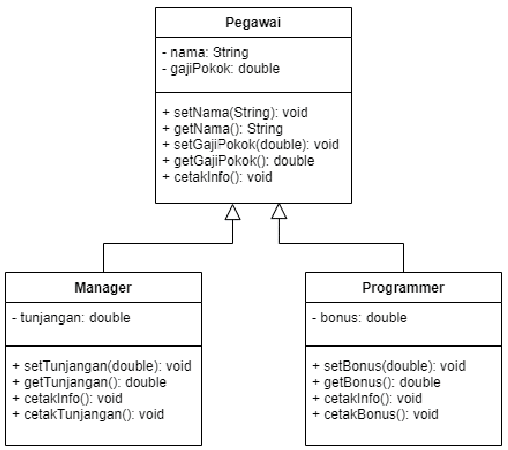
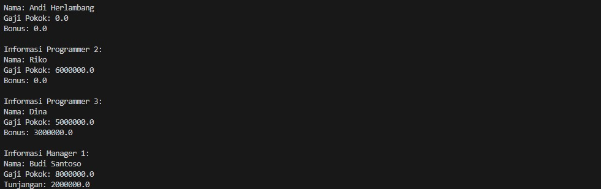

# Pertemuan7_Constructor

## Profil
| Variable | Isi |
| -------- | --- |
| **Nama** | Intan Virginia Aulia Putri |
| **NIM** | 312310657 |
| **Kelas** | TI.23.A.6 |
| **Mata Kuliah** | Pemrograman Orientasi Objek |

### Latihan

Dari modul praktikum 3, tambahkan constructor pada masing-masing class dan tambahkan overload dan override constructor tersebut.

Pegawai
``` JavaSricpt
public class Pegawai {
    private String nama;
    private double gajiPokok;

    public Pegawai (String nama, double gajipokok) {
        this.nama = nama;
        this.gajiPokok = gajipokok;
    }

    // Setter dan getter untuk nama
    public void setNama(String nama) {
        this.nama = nama;
    }
    public String getNama() {
        return nama;
    }

    // Setter dan getter untuk gaji pokok
    public void setGajiPokok(double gajiPokok) {
        this.gajiPokok = gajiPokok;
    }
    public double getGajiPokok() {
        return gajiPokok;
    }

    // Metode untuk mencetak informasi pegawai
    public void cetakInfo() {
        System.out.println("Nama: " + nama);
        System.out.println("Gaji Pokok: " + gajiPokok);
    }

}
```
Kelas `Pegawai` adalah kelas dasar (superclass) yang merepresentasikan data pegawai secara umum, yaitu memiliki atribut `nama` dan `gajiPokok`. Berikut adalah penjelasan atribut, konstruktor, dan metode dalam kelas `Pegawai`:
- **Atribut**:
  - `nama`: Menyimpan nama pegawai dalam bentuk `String`.
  - `gajiPokok`: Menyimpan gaji pokok pegawai dalam bentuk `double`.
- **Konstruktor**:
  - `Pegawai(String nama, double gajiPokok)`: Konstruktor ini digunakan untuk menginisialisasi objek `Pegawai` dengan nilai `nama` dan `gajiPokok`.
- **Setter dan Getter**:
  - `setNama` dan `getNama`: Mengatur dan mengambil nilai `nama`.
  - `setGajiPokok` dan `getGajiPokok`: Mengatur dan mengambil nilai `gajiPokok`.
- **Metode `cetakInfo`**:
  - Metode ini mencetak informasi pegawai, yaitu `nama` dan `gajiPokok`.

Manager
``` Javasripct
public class Manager extends Pegawai {
    private double tunjangan;

    public Manager(String nama, double gajipokok, double tunjangan) {
        super(nama, gajipokok);
        this.tunjangan = tunjangan;
    }

    // Setter dan getter untuk tunjangan
    public void setTunjangan(double tunjangan) {
        this.tunjangan = tunjangan;
    }
    public double getTunjangan() {
        return tunjangan;
    }

    // Metode untuk mencetak informasi manager
    @Override
    public void cetakInfo() {
        super.cetakInfo();
        System.out.println("Tunjangan: " + tunjangan);
    }

}
```
Kelas `Manager` adalah turunan dari kelas `Pegawai`, yang merepresentasikan seorang pegawai dengan jabatan manajer. Selain atribut `nama` dan `gajiPokok` dari kelas `Pegawai`, kelas ini juga memiliki atribut tambahan `tunjangan`.
- **Atribut**:
  - `tunjangan`: Menyimpan tunjangan manajer dalam bentuk `double`.
- **Konstruktor**:
  - `Manager(String nama, double gajiPokok, double tunjangan)`: Konstruktor ini memanggil konstruktor `Pegawai` untuk mengatur `nama` dan `gajiPokok`, kemudian mengatur nilai `tunjangan`.
- **Setter dan Getter untuk `tunjangan`**:
  - `setTunjangan` dan `getTunjangan`: Mengatur dan mengambil nilai `tunjangan`.
- **Metode `cetakInfo` (Override)**:
  - Metode ini mengoverride metode `cetakInfo` di kelas `Pegawai`. Selain mencetak `nama` dan `gajiPokok`, metode ini juga mencetak `tunjangan`.

Programmer
``` Javascript
public class Programmer extends Pegawai {
    private double bonus;

    public Programmer(String nama, double gajipokok, double bonus) {
        super(nama, gajipokok);
        this.bonus = bonus;
    }

    // Setter dan getter untuk bonus
    public void setBonus(double bonus) {
        this.bonus = bonus;
    }
    public double getBonus() {
        return bonus;
    }

    // Metode untuk mencetak informasi programmer
    @Override
    public void cetakInfo() {
        super.cetakInfo();
        System.out.println("Bonus: " + bonus);
    }

    // Metode tambahan untuk mencetak bonus
    public void cetakBonus() {
        System.out.println("Bonus: " + bonus);
    }

}
```
Kelas `Programmer` adalah turunan dari kelas `Pegawai`, yang merepresentasikan seorang pegawai dengan jabatan programmer. Selain `nama` dan `gajiPokok`, kelas ini juga memiliki atribut tambahan `bonus`.
- **Atribut**:
  - `bonus`: Menyimpan bonus yang diterima oleh programmer dalam bentuk `double`.
- **Konstruktor**:
  - `Programmer(String nama, double gajiPokok, double bonus)`: Konstruktor ini memanggil konstruktor `Pegawai` untuk mengatur `nama` dan `gajiPokok`, lalu mengatur nilai `bonus`.
- **Setter dan Getter untuk `bonus`**:
  - `setBonus` dan `getBonus`: Mengatur dan mengambil nilai `bonus`.
- **Metode `cetakInfo` (Override)**:
  - Metode ini mengoverride metode `cetakInfo` di kelas `Pegawai`. Selain mencetak `nama` dan `gajiPokok`, metode ini juga mencetak `bonus`.
- **Metode Tambahan `cetakBonus`**:
  - Metode ini mencetak hanya nilai `bonus`.
  - 
#### Tampilan Output

